# Vagrant-Ansible


- First of all, we all have Virtual Box on our local hosts, and we know how to use Vagrant.
- Compared to previous times, in order to be able to use Ansible, we will need to create 3 VMs. This is the minimum requirement for Ansible.
- One of them will be an Ansible Controller, and the other 2 will be web (for nodejs) and db (for mongodb).
- Previously, we needed to manually SSH in each machine (web and db).
- We also had to SSH into the machines to install the other dependencies.
- With Jenkins, we managed to automate the entire process of using our code to test it and automate the process of creating instances with installed dependencies without having to SSH into them. 
- However, the Cloud end of the process is not automated, as we do not know how to automate the creation of EC2 instances that will be provisioned by Jenkins.
- This is where Ansible comes in place. 
- As setting up the Cloud bit consumes money, we will focus on setting up everything locally first, and then proceed with the Cloud end.
- Locally, we will create an Ansible Controller with 2 agent nodes (web and db VMs).
- As Ansible is `Agentless`, we will be able, from the Ansible Controller to ssh into the 2 agent nodes without needing to install Ansible in them as well. We just need to establish the connection between the Ansible Controller and the 2 Agent nodes VMs.
- In order to create the Ansible Controller, we will still need to install dependiencies that will make that particular VM an Ansible Controller, but those dependencies and installations don`t need to be done in the agent Nodes.
- With the help of Ansible, if we run a command in Ansible, we can run the same commands in all the other machines as long as they are set as Agent Nodes.

## Steps:

### ***Step 1: Creating the VMs***
- Create a local folder called `Ansible`.
- Open the folder in `Visual Studio Code` and create a `Vagrantfile`. For the creation of Vagrantfiles, you do not need to add any `.type` at the end of the file. This file becomes a `Vagrantfile` when the script is added to it. 
- Copy the following configuration within your `Vagrantfile`:
```
# ansible-tech201


# -*- mode: ruby -*-
 # vi: set ft=ruby :
 
 # All Vagrant configuration is done below. The "2" in Vagrant.configure
 # configures the configuration version (we support older styles for
 # backwards compatibility). Please don't change it unless you know what
 
 # MULTI SERVER/VMs environment 
 #
 Vagrant.configure("2") do |config|
 # creating are Ansible controller
   config.vm.define "controller" do |controller|
     
    controller.vm.box = "bento/ubuntu-18.04"
    
    controller.vm.hostname = 'controller'
    
    controller.vm.network :private_network, ip: "192.168.33.12"
    
    # config.hostsupdater.aliases = ["development.controller"] 
    
   end 
 # creating first VM called web  
   config.vm.define "web" do |web|
     
     web.vm.box = "bento/ubuntu-18.04"
    # downloading ubuntu 18.04 image
 
     web.vm.hostname = 'web'
     # assigning host name to the VM
     
     web.vm.network :private_network, ip: "192.168.33.10"
     #   assigning private IP
     
     #config.hostsupdater.aliases = ["development.web"]
     # creating a link called development.web so we can access web page with this link instread of an IP   
         
   end
   
 # creating second VM called db
   config.vm.define "db" do |db|
     
     db.vm.box = "bento/ubuntu-18.04"
     
     db.vm.hostname = 'db'
     
     db.vm.network :private_network, ip: "192.168.33.11"
     
     #config.hostsupdater.aliases = ["development.db"]     
   end
 
 
 end
```
- Now that we have our `Vagrantfile`, we need to open `Virtual Box`.
- Open a `Bash` terminal in VSC or an independent `Git Bash` terminal (and navigate to the folder with the `Vagrantfile`) and run:
```
vagrant up
```
---

### Please note:
- If you encounter any issue when attempting to run the Vagrant file, it means you might have a typo in the name of the Vagrant file. **Please, make sure the Vagrant file is named `Vagrantfile` and nothing else.**

---

- The creation of the VMs will take a while as 3 VMs are being created. So, please be patient.
- Once the creation of the VMs is finished, we need to `SSH` into each machine and establish the connection to the internet viat our local host.
- Simply do that by running the following:

1. For the Controller VM
```
vagrant ssh controller

sudo apt-get update -y 

sudo spt-get upgrade -y

exit
```

2. For the Web VM
```
vagrant ssh web

sudo apt-get update -y

sudo apt0get upgrade -y

exit
```

3. For the DB VM
```
vagrant ssh db

sudo apt-get update -y

sudo apt-get upgrade -y

exit
```
- Again, the updates and upgrades might take a long time, depending on your local machine`s internet connection and your internet overall speed. Please, be patient.
- Once all the updates and upgrades are done, please SSH back into the Controller VM.
```
vagrant ssh controller
```
- Once inside the Controller VM, we need to install some dependencies for our system.
```
sudo apt-get install software-properties-common

sudo apt-add-repository ppa:ansible/ansible
# When running this, you might be prompted to ENTER mid-process. If so, pelase press ENTER

sudo apt-get update -y 

sudo apt-get install ansible -y

ansible --version
# to double-check the version of ansible
# although we did not install python, as it is one of the requirements for ansible, it installed it and it is using the default version (python 2.7)

cd etc/

cd ansible/

# this confirms that we have an Ansible Controller set up
```
- Happy days! We set up our `Ansible Controller` and we are ready to move forward into communicating with the other 2 VMs, which will be the Agen Nodes.


### ***Step 2: Connecting our VMs with the `Ansible Controller` VM***

- First step will be to boot up our VMs by doing:
```
vagrant up

```
- Now, let`s make sure that all the machines are working by running :
```
vagrant status
```

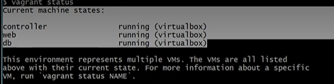

- You should see the above status (If you have the same issue as me, your `db` VM might not show up, which for now is okay).
- If your VMs are running as normal, we will now have to ssh into each machine individually (controller, web and db) and run the following commands to establish the conntection to the internet.
```
sudo apt-get update -y

sudo apt-get upgrade -y
```

---

### Possible blockers:
- If you saved the state of the VMs before turning them off, you might encounter issues with ssh-ing into them.
- For me, the issue has been that I am unable to ssh into the `db` VM via my local host. I can only access the shell of the VM from `Virtual Box`. This is due to missbehaviour of Vagrant when running `vagrant up`.
- As `Vagrant` did not boot up my `db` VM, I had to start it manually from `virtual Box`.

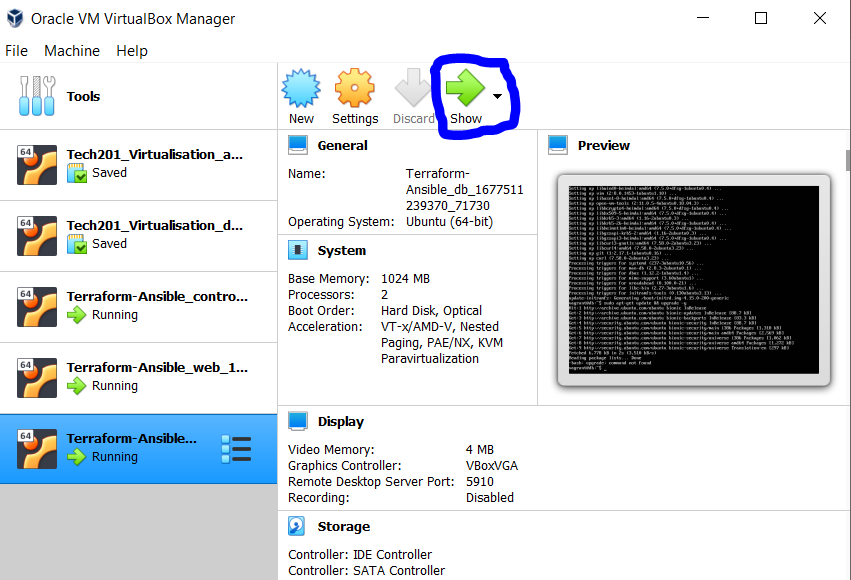

- This will automatically open the `Shell` terminal to interact with the VM. However, we need to `SSH` into the VM.
- One option would be to run 

```
vagrant reload db
```
- However, in my instance this did not work either.
- Another option would be to use the `Shell` terminal in Virtual Box for the `db` VM to run:
```
sudo apt-get update -y
sudo apt-get upgrade -y
```
- Once the updates and upgrades are done, and the VM is up and running, attempt to run `vargarnt ssh db` from a `Git Bash` terminal. 
- Even if we cannot `ssh` into the `db` VM via local host, the main point is to be able to `ssh` into the `db` VM via our `Controller` VM. So, if we can `ssh` in the`db` VM via the `Controller` VM, there should not be any issues for now.
- However, there might be a need to run `vagrant destroy` and re-attempt the entire process so far.
---
- The purpose of the following steps is to establish the communication within the machines. So, we will need to add the ip addresses of the `Agent nodes` VMs so the controller can communicate with them. If the connection is established, this means that we can configure the `Agent nodes` without having to `ssh` into them from our local host and do everything manually.

(Configurations within the `Controller` VM for the `Agent nodes` is done through something called `Playbooks`, which are written in `YAML` language -- playbooks are similar to the provision files we have done for the VMs previously.)

- What we would like to do now, is to check if we have proper communication between the machines. This time we will try to use the `password` instead of `ssh`, which we will have to set up on our `Controller`. 
- Run the following commands in a `Git Bash` terminal.
```
vagrant ssh controller
cd /etc
cd ansible/
# the location where we have the `hosts` file
```

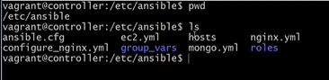
- Within the `hosts` file, we need to add the IP addresses of the `Agent Nodes`. 
- The purpose of these actions is to see if we can `ssh` into the `web` and `db` VMs via our `Controller`, which is officially a `Controller` due to us installing `Ansible` in it.
- We need to now continue in the `Git Bash` terminal. 
```
ssh vagrant@192.168.33.10 #IP address of the `web` VM
```
- By running this command, the Controller will now send a request to the `web` VM to `SSH` in. 
- We will be asked if we want the `web` VM to create an ssh key and store it to allow access to the `Controller` and we should say Yes.
- There is a chance this process will fail and we will get `Aceess denied`, in which case we will need to go in the `hosts` file and fix the issue. 
- It might be the case that you are simply asked for the password, and if you know the password, the process might just work.
- If prompted to instert the password, as my VMs are created locally via Vagrant, my password is "vagrant", and I should be granted access to `SSH` into the `web` VM via the `Controller`. 

#### ***If you got `access denied` when attempting to ssh within the `web` VM, please make sure you are still within the `Controller` VM.***
#### ***If you got access within the `web` VM, please return to the `Controller` VM using `exit` + Enter***.
- Attempt now to `ssh` into the `db` VM.
```
ssh vagrant@192.168.33.11 # IP address of the `db` VM

```
- The same things will happen with the `db` VM as with the `web` VM.
- At this present moment, we were able to `SSH` into the `web` and `db` VMs with the help of `Linux`, not `Ansible`. It is simply `Linux` SSH-ing into another `Linux` machine.
- With `Ansible`, we can check that these machines are communicating with each other. We can achieve that by running the `ad-hoc` Ansible command `ping`. 

```
sudo ansible -m ping web 

```
- At the current moment, the outcome of this command should be a negative one. This is purely due to the fact that we have not added the IP addresses of the `web` and `db` VMs to our `Controller` hosts file.
- Just like with `Jenkins`, now, we will have to let `Ansible` know which IP addresses it can attempt to communicate with, and if so, through which ptocol (`SSH` or `password`).
```
# fist, make sure that we are still in /etc/ansible

sudo nano hosts

# add this to your host file
[web]
192.168.33.10 ansible_connection=ssh ansible_ssh_user=vagrant ansible_ssh_pass=vagrant
# using ssh pass for ansible connection between controller & agent node
# add the above comment in the file as well

Ctrl + X
Y
Enter

cat hosts # to make sure the change has been added
```
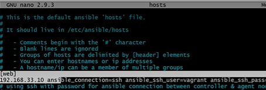

- Once we added this line, the next time we `ping` the `web` VM, it will ask us for the password we just set. So, every time we try to communicate with the `web` machine, the system will search for the IP address, will try to connect to it, and it will know to ask us to introduce the username and password we just set.
- Now, we can attempt again the `ping` command.

```
sudo ansible -m ping web
```
- If everything went well, you should be seeing this result:

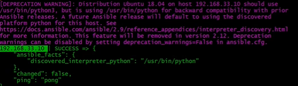

---
### Possible blockers:
- You might be getting an error stating that `the SSH password could not be verified as no password verification has been enabled`. 


- In this case, we will need to follow some steps:
1. We need to be sure we can `ssh` into the `web` VM.
```
ssh vagrant@192.168.33.10
```

2. If we managed to `ssh` into the `web` VM, we now have to manually enable the use of the `SSH` password.

```
ls -a

cd .ssh

ls

sudo nano authorized_keys

```
- If you can see the key inside, it means that the `ssh-rsa` key has been saved. So, you can exit the file using `CTRL + X`.
3. We now need to verify the configuration of the sshd file. So, from the current location, run the following:
```
cd ..

cd /etc

ls

cd ssh

ls

# should be able to see a `sshd_config` file

sudo nano sshd_config

# in this file, we will have to uncomment some lines

```
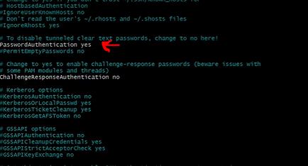

- This line will be commented out so we need to uncomment it as in the picture, by removing the `#` at the beginning of the line. By uncommenting this line we allow the password checking. 
- Save the file using `CTRL + X`, `Y`, `Enter`.
- Now, we need to restart the `ssh`.
```
sudo systemctl restart ssh

sudo su

```
- Now, we need to set up the password.
```
password

# type in "vagrant" when prompted


```
- Now, we need to go back to the `sshd_config` file and uncomment some more lines.

```
sudo nano sshd_config
```

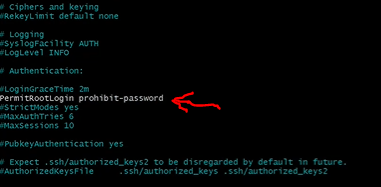
- Please, also uncomment this line, as it will be initially commented. Save the file using `CTRL + X`, `Y`, and `ENTER`. 
- Now, we will need to restart the `ssh` again just so the change can be saved.
```
sudo systemctl restart ssh
```
4. Open a new `git bash` terminal and do `vagrant ssh controller`. 
- We need to diasble the key in the `ansible.config` file.
```
cd /etc

cd ansible/ 

ls

sudo nano ansible.config

# add this line under [defaults]

host_key_checking = false

```
- It should look like this:

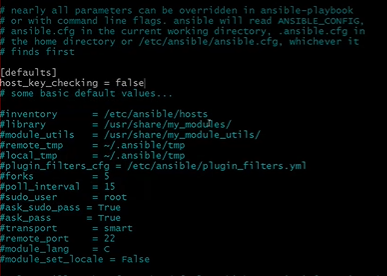

5. Run the `ping` command again.
```

sudo ansible -m ping web
```
- The `ping` command should return as `SUCCESS` with the output `pong`. 


---
### ***Step 3: Configuring our VMs using Ansible `Ad-hoc commands` and `Playbooks`***

- From this point onward, we will focus on setting up `Playbooks`, which will shows us the real power of `Ansible`. 
- We will start easy by rechecking the status of the communication between the `Controller` and the `web` VM (`Agent node`).

```
sudo ansible -m ping web
```
- This is an `ad hoc` Command in Ansible. So, we can run this command hundreads of times to ping other machines, without having to actually build the script for it ourselves.
- There are plenty of modules available in Ansible documentation. `Ping` is one such module. The `ping` module gives us information about a machine without having to `ssh` into the machine. 
- `Ad-hoc` command are extremely useful and powerful. By using `ad-hoc` commands, we can find out information about a machine or run commands on a machine without having to `ssh` into that machine, and we can even run the same command on multiple machines simultaneously. 
- We will now look at some of these `Ad-hoc` commands:

#### ***Examples***: 

1.  Currently, our VMs are empty. We created them and we are aware that there is nothing in them. In a real-life scenario, if we were to do server patching, we don`t necessarily know which machine is running on what OS.
-  In this case we will use the following `ad hoc` commands:
```
sudo ansible web -a "uname -a"
```
- This command will output the info about the `web` VM without us having to `ssh` into it. 

2. If we want to find out in what time zone a specific node is running in we can do that using the following `ad-hoc` command:
```
sudo ansible all -a "date" 

```
- This will output the result of the command for all the nodes that we have communicating with the `Controller` -  at the moment we only have `web`, but this is to showcase the power of `Ansible`.

3. Checking the memory available within a machine, if, for example, we need to run an update that has high requirements:
```
sudo ansible web -a "free -m"
```
- This command will output how much memory we have used within the VM, how much we have available, etc, all of this without having to `ssh` within that specific VM.

4. Finding out if a file exists within a VM already. 
```
sudo ansible web -a "ls -a"
```
- This command will show us all the hidden file, or all the existing files ("ls") within a VM, again without having to actually check the VM ourselves. 

[More Ad-hoc commands in Ansible](https://docs.ansible.com/ansible/latest/command_guide/intro_adhoc.html)

---

### Exercise: Create a file.txt in the `Controller` VM and copy it in the `web` VM using ad-hoc commands.
- Create a file called `file.txt`.
- Edit the file by adding a line of text.
- To copy this file within our `web` we can use the following command:
```
sudo ansible web -m copy -a "src=/etc/ansible/file.txt dest=/tmp/"
```
- If everything went well, we should be see our file in the `web` VM at the specified path.

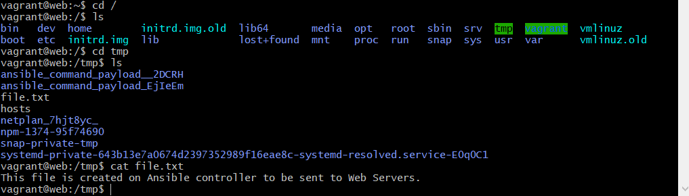

---

## ***Playbooks***

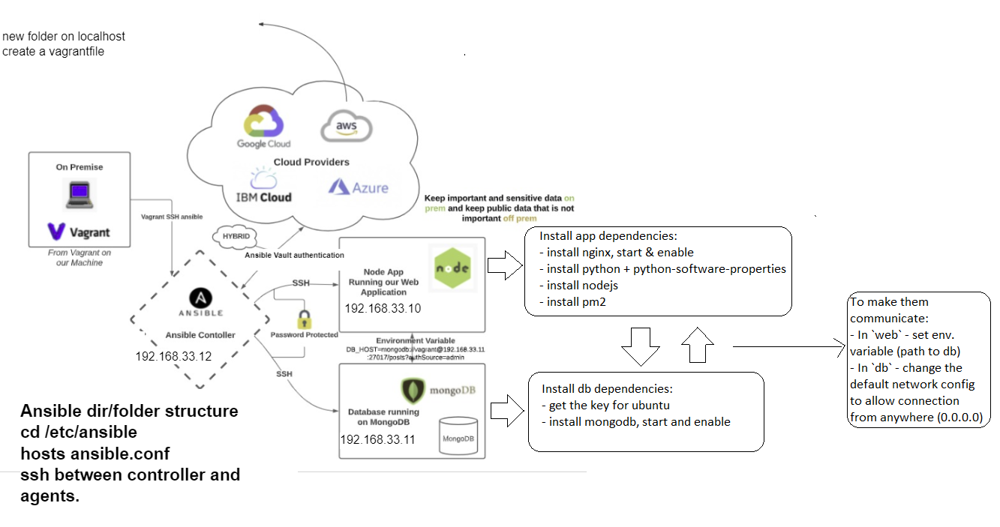

If we wanted to configure our VMs with the required dependencies for monolith architecture without having to `ssh` into the VM, we could do that by using `Playbooks`.

### Configuring the `web` VM

1. First, we need to provision the `web` VM with the `app` folder that has the app code. So, we will create a Playbook for that:
```
sudo nano app-playbook.yml
```

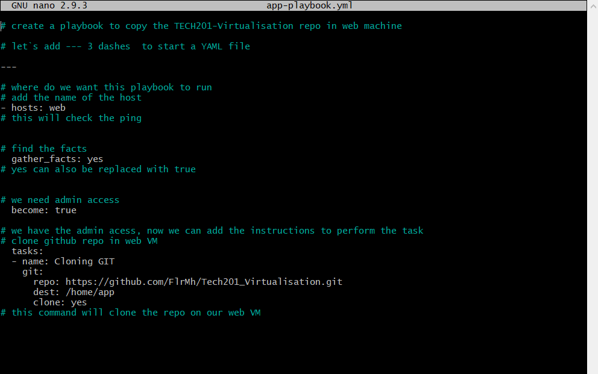

```
# create a playbook to copy the TECH201-Virtualisation repo in web machine

# let`s add --- 3 dashes  to start a YAML file

---

# where do we want this playbook to run
# add the name of the host
- hosts: web
# this will check the ping


# find the facts
  gather_facts: yes
# yes can also be replaced with true


# we need admin access
  become: true

# we have the admin acess, now we can add the instructions to perform the task
# clone github repo in web VM
  tasks:
  - name: Cloning GIT
    git:
      repo: https://github.com/FlrMh/Tech201_Virtualisation.git
      dest: /home/app
      clone: yes
# this command will clone the repo on our web VM

```

- When these configurations are ready, we can run the playbook:
```
sudo ansible-playbook app-playbook.yml
```

- So now, if we run the ad-hoc command to verify the files in the `web` VM, we will be able to see the `app` folder now in there.

2. Let`s create a Playbook that installs nginx on our web VM.
```
sudo nano nginx-playbook.yml
```
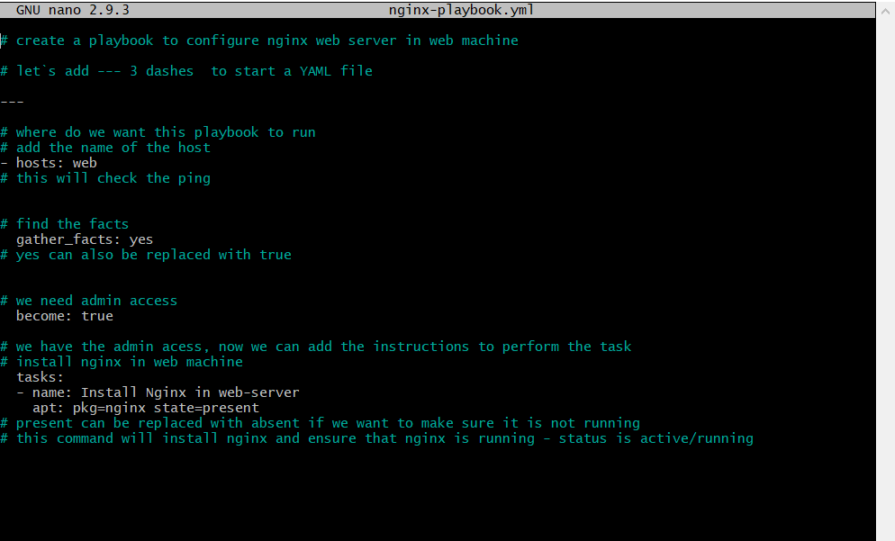

- To run this playbook we will use:
```
sudo ansible-playbook nginx-playbook.yml
```
- If everything went well, we will now be able to access the `Welcome to nginx!` when accessing the IP address of the `web` VM.

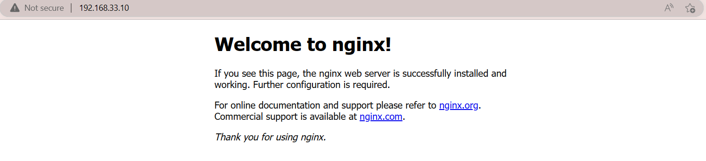

3. Considering our app needs `nodejs` and `npm` to run, we need to create a playbook that installs these dependiencies on our `web` VM. 
```
sudo nano npm-playbook.yml
```

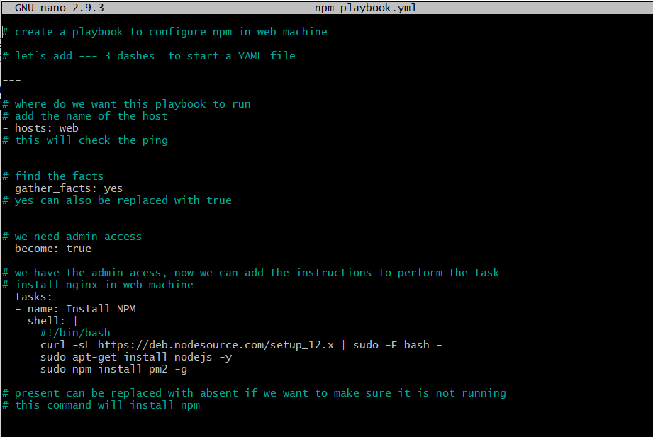

```
# create a playbook to configure npm in web machine

# let`s add --- 3 dashes  to start a YAML file

---

# where do we want this playbook to run
# add the name of the host
- hosts: web
# this will check the ping


# find the facts
  gather_facts: yes
# yes can also be replaced with true


# we need admin access
  become: true

# we have the admin acess, now we can add the instructions to perform the task
# install nginx in web machine
  tasks:
  - name: Install NPM
    shell: |
      #!/bin/bash
      curl -sL https://deb.nodesource.com/setup_12.x | sudo -E bash -
      sudo apt-get install nodejs -y
      sudo npm install pm2 -g

# present can be replaced with absent if we want to make sure it is not running
# this command will install npm

```
- I chose to use shell commands in this playbook as installing a specific version of `nodejs` has been difficult without using shell. 
- As you can see in the commands, to use shell we will need to use 
```
shell: |
  #!/bin/bash
  scripts

```
- This playbook wil install us the dependencies required to be able to run our app. 

4. As a last step, we will need a playbook that will run the commands that launch the app in our `web` VM:
```
sudo nano start-app-playbook.yml
```

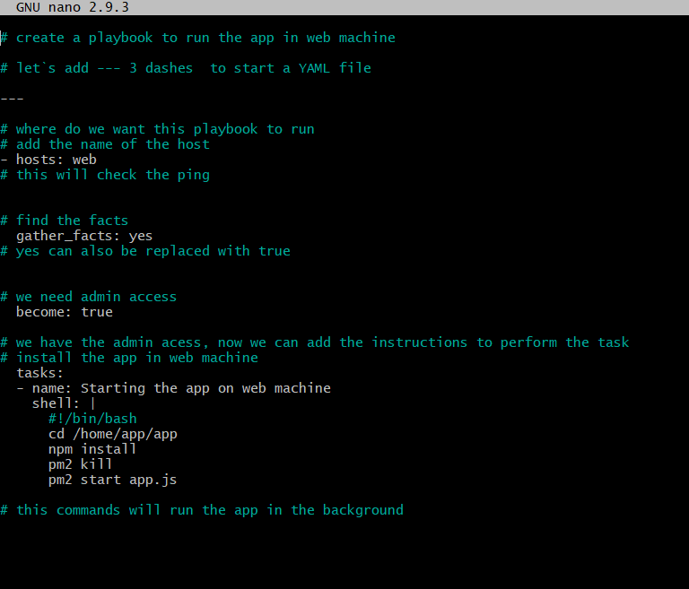


- This will allow us to access our app via the `web` VM IP address, followed by the port 3000 where our app is listening.

 
 ---

### ***PLEASE NOTE***: It is not recommended to run the playbook with commands that run processes in the foreground (e.g. `node app.js`), as the moment you stop the run of the playbook you will be kicked out of the terminal, and the entire app will stop running. 

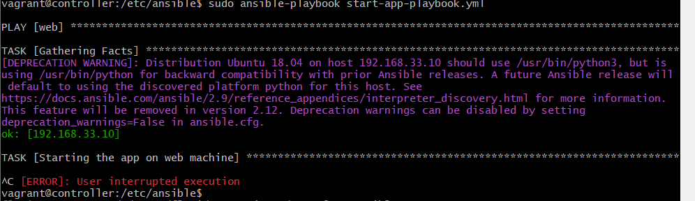

### ***Instead, try to use commands that will allow the app to run in the background, so you still have access to the terminal once you start up the app.
```
# e.g. 
pm2 kill
pm2 start app.js

# or 

nohup npm start 2>/dev/null 1>/dev/null&
```
---
