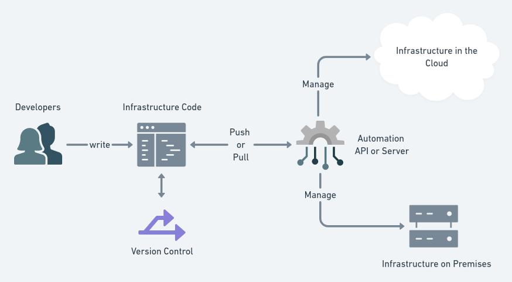

# Infrastructure as Code (IaC)
Introduction to Infrastructure as Code (Iac)

---

## What is Infrastructure as Code (IaC) and why do we use it?
- Infrastructure as Code (IaC) uses a high-level descriptive coding language to automate the provisioning of IT infrastructure. 
- This automation eliminates the need for developers to manually provision and manage servers, operating systems, database connections, storage, and other infrastructure elements every time they want to develop, test, or deploy a software application.
- IaC is also an essential DevOps practice, indispensable to a competitively paced software delivery lifecycle. 
- It enables DevOps teams rapidly create and version infrastructure in the same way they version source code and to track these versions so as to avoid inconsistency among IT environments that can lead to serious issues during deployment.
- Benefits:
1. Cost reduction
2. Increase in speed of deployments
3. Reduce errors 
4. Improve infrastructure consistency
5. Eliminate configuration drift

### Configuration management

- Configuration management is the process of identifying and tracking the state of a system's components and ensuring they are properly configured, updated, and maintained over time.
- It involves establishing and maintaining a consistent and reliable set of software and hardware configurations, as well as documenting changes and ensuring that they are properly controlled and communicated to stakeholders.
- Configuration management is a critical component in a software development lifecycle for maintaining systems in a desired, consistent state.
- Infrastructure as Code (IaC) was a big step for configuration management where the entire hardware was defined as code. 
- IaC tools such as Terraform, Chef, Puppet, and Ansible played a key role in simplifying and scaling infrastructure management. They helped speed up infrastructure provisioning and reduced costs by improving resource utilization.

### Orchestration

- Orchestration refers to the automated coordination and management of multiple systems or processes to achieve a specific goal or outcome. 
- In the context of IT, orchestration involves automating the deployment, configuration, and management of complex applications and infrastructure across multiple systems or cloud environments.
- This is typically achieved using tools and platforms that allow users to define workflows, dependencies, and policies that govern the behavior of the underlying systems. 
- Orchestration can help organizations achieve greater efficiency, agility, and scalability in their IT operations by automating repetitive tasks, reducing errors, and improving overall system performance.

### Tools used in IaC
- Infrastructure as Code (IaC) is a practice of managing and provisioning infrastructure through machine-readable definition files, rather than manual processes. Some of the tools commonly used in IaC include:

1. Terraform: An open-source tool for building, changing, and versioning infrastructure safely and efficiently across multiple cloud providers.

2. Ansible: A configuration management tool that uses declarative YAML files to define the desired state of systems, and can be used for provisioning and configuring infrastructure.

3. Puppet: A configuration management tool that uses a declarative language to describe the desired state of systems, and can be used for provisioning, configuring, and managing infrastructure.

4. Chef: A configuration management tool that uses a domain-specific language to define the desired state of systems, and can be used for provisioning, configuring, and managing infrastructure.

5. CloudFormation: An Amazon Web Services (AWS) service that allows users to define and manage infrastructure resources in a JSON or YAML file.

6. Kubernetes: A container orchestration platform that uses YAML files to define and manage containerized applications and infrastructure.

These tools help automate the deployment and management of infrastructure, reducing manual errors and improving consistency and reliability of the infrastructure.

### Who uses IaC?

1. Technology: Technology companies use IaC to support the development and deployment of software applications, and to manage the infrastructure that supports them. This includes companies that develop software products, as well as those that provide cloud-based services.

2. Financial services: Financial services companies use IaC to manage and maintain their IT infrastructure, including mission-critical systems that support trading and other financial transactions. IaC can help ensure the consistency and reliability of these systems, and reduce the risk of manual errors and outages.

3. Healthcare: Healthcare organizations use IaC to manage and maintain their IT infrastructure, including electronic health records (EHRs) and other patient care systems. IaC can help ensure the security and compliance of these systems, and reduce the risk of downtime and data breaches.

4. Retail: Retail companies use IaC to manage and maintain their IT infrastructure, including e-commerce platforms and inventory management systems. IaC can help ensure the scalability and reliability of these systems, and reduce the risk of manual errors and outages.

## Terraform

- Terraform is an open-source tool for building, changing, and versioning infrastructure safely and efficiently across multiple cloud providers.
-  It allows users to define infrastructure resources as code in a high-level configuration language, and automates the deployment and management of those resources in a consistent and repeatable way. 
- Terraform provides a flexible and scalable approach to infrastructure management, and allows users to easily manage complex cloud-based environments.

## Ansible

- Ansible is an open-source IT automation tool that simplifies the deployment, configuration, and management of systems and applications.
- It uses a simple, human-readable YAML language to define configuration files, called "playbooks", which describe the desired state of systems. 
- Ansible can automate tasks such as software installation, configuration management, and application deployment across multiple systems or cloud environments. 
- It is agentless, meaning that it does not require software to be installed on the target systems, and is highly scalable and efficient. 
- Ansible can help organizations improve efficiency, consistency, and reliability in their IT operations.

### IaC on-prem, hybrid, Cloud

frastructure as Code (IaC) can be used to manage and provision infrastructure across on-premises, hybrid, and cloud environments. Here's how IaC can be applied to each of these environments:

1. On-premises: IaC can be used to manage and provision physical servers, networking devices, storage devices, and other infrastructure resources within a data center. Tools like Ansible, Puppet, and Chef can be used to automate the deployment and management of these resources, allowing system administrators to easily manage complex environments with consistency and efficiency.

2. Hybrid: A hybrid environment is a mix of on-premises and cloud infrastructure. IaC can be used to manage and provision resources across both environments, ensuring consistency and efficiency in deployment and management. Tools like Terraform and CloudFormation can be used to define infrastructure resources as code, and automate the deployment and management of those resources across multiple environments.

3. Cloud: In a cloud environment, IaC can be used to automate the deployment and management of infrastructure resources within cloud providers such as AWS, Azure, and Google Cloud. Tools like Terraform and CloudFormation can be used to define infrastructure resources as code, and automate the deployment and management of those resources across multiple cloud environments. This allows organizations to take advantage of the scalability, flexibility, and cost-effectiveness of cloud infrastructure while ensuring consistency and efficiency in deployment and management.

