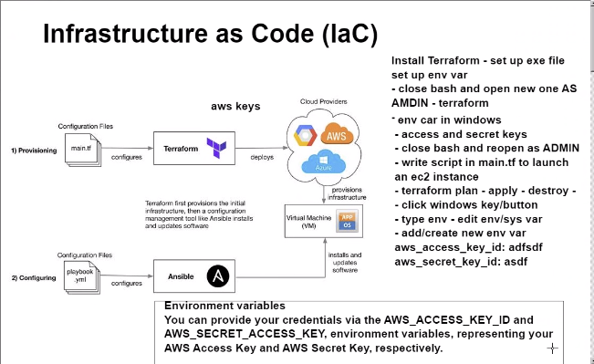
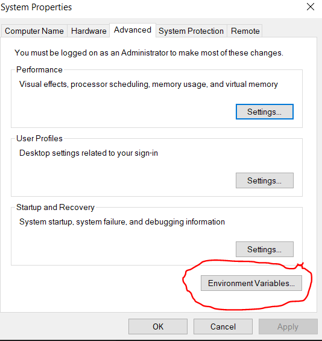
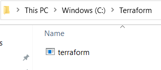
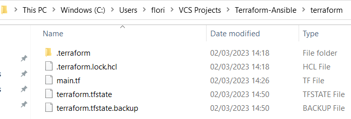
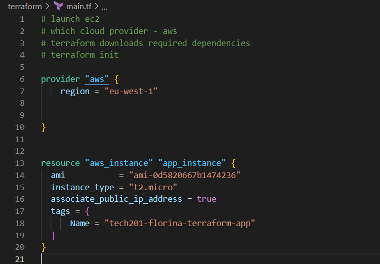
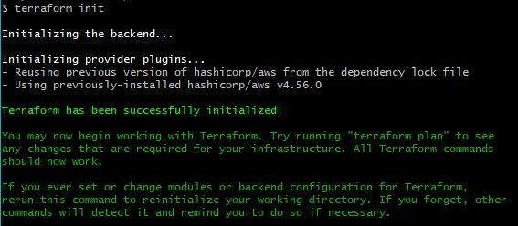
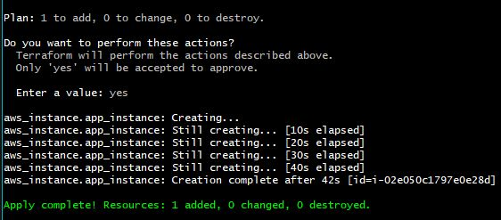
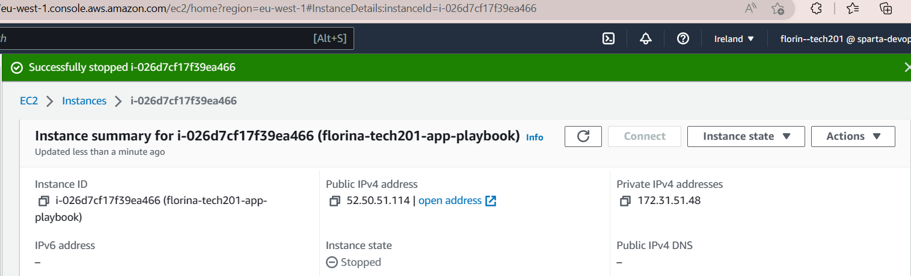
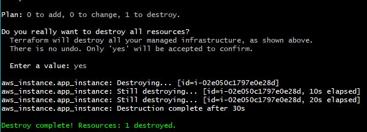

# Terraform
- Terraform is an orchestraction tool used within IaC.
- Terraform is used for building infrastructure, e.g: services (like ec2), vpc's, etc., whereas ansible is used to manage configurations within infrasturcture and services, e.g: provision instances with playbooks.
- Terraform files can b identified by the `.tf`. Terraform scripts are held in the `main.tf` file, located within our local host.



### Install Terraform
[Terraform installation](https://developer.hashicorp.com/terraform/downloads?product_intent=terraform)

[Steps to install Terraform](https://www.youtube.com/watch?v=SkcRSJWNRS8)

- Setting up env variables for our AWS access and secret kets:
1. On your local host, go to the left had search bar and type env. Select the option that is named `Edit environment variables`.
2. Select enviroment variables.




### For security purposes, from this point on, I will not be able to supply anymore screenshots as my Environment Variables will be exposed.
3. Click `New` under `User variables`.

4. Add the `AWS_ACCESS_KEY_ID` as the title of the Environment Variable, and for value, the AWS access key you have been provided. select OK when you are sure that the Environmental Variable is correct.
5. Do the same for `AWS_SECRET_KEY`, using for value the AWS secret key you have been provided.
6. Select OK. 
7. Once `Terraform` has been installed, open a fresh `Git Bash` terminal, with Admin access, and run:
```
terraform --version
```
- Once terraform is up and running, we are ready to try and launch an `EC2` instance.


## Launching an instance using Terraform

1. In order to launch an `Ec2` instance using terraform, we will need to create a `main.tf` file within our terraform folder. 
```
sudo nano main.tf
```
---
### Please note!!
- You need to have a **separate file for terraform, than the one used when installing the software**.


- This is the location of the installation folder.


- This is our terraform working folder, where we will create our `mail.tf`.
---
2. Within the `main.tf` file, we will need to introduce the script for the creation of our `EC2` instance.

```
# launch ec2
# which cloud provider - aws
# terraform downloads required dependencies
# terraform init

provider "aws" {
    region = "eu-west-1"
  

}


resource "aws_instance" "app_instance" {
  ami           = "ami-0d5820667b1474236"
  instance_type = "t2.micro"
  associate_public_ip_address = true
  tags = {
      Name = "tech201-florina-terraform-app"
  }
}


```

- In the actual file, it will look something like this:



- For a better visualization of the code, please use an IDE (I used Visual Studio Code with Terraform installed as an extension).

3. Now that our `main.tf` is set, we are ready to run the commands to launch the `EC2` instance.
- In the `git bash` terminal that has as `pwd` the path to the folder with `main.tf`, run the following:
```
terraform init 
# initialises the software
```


```
terraform plan 
# check for any errors in the code in the main.tf file
```


```

terraform apply
# will run the file and the script inside - creating the instance


```



- If everything went well, you should be able to see your instance being create on `AWS`.



- For cost effectiveness purposes, when you are ready to terminate the instance, please run:
```
terraform destroy
```


- Happy days! We have showcase how easy it is to create `EC2` instances using `Terraform` with just a few lines of code.


---
## Possible blockers 

- You might receive errors specifying `"Access denied!"`. 
- In the case of such error, double check that your `AWS_ACCESS_KEY_ID` and `AWS_SECRET_KEY` are correct! Check them letter by letter if needed!
- Make sure that after any changes made to the keys, you always open a fresh `Git bash` terminal with admin access.
- Also, in some cases, it might help to restart your local machine. This will save the changes made on the `env variables`. 


---

